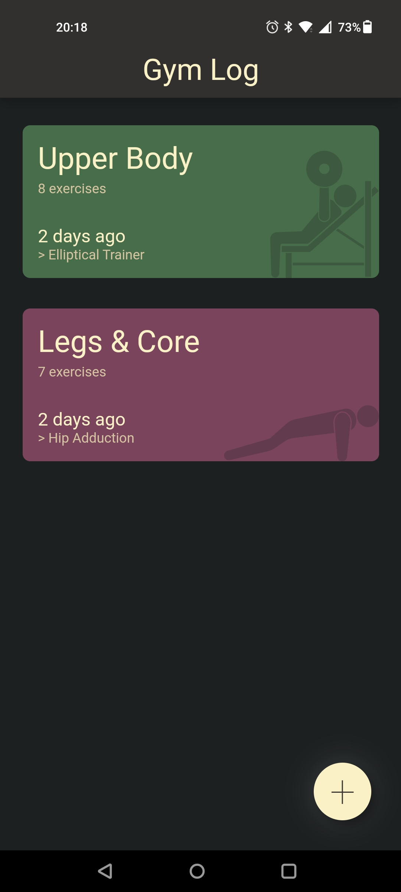
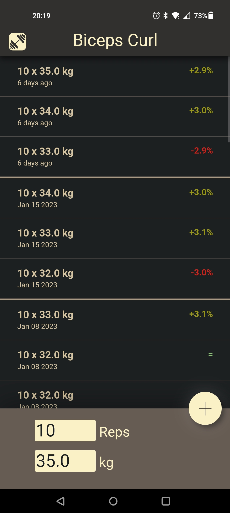
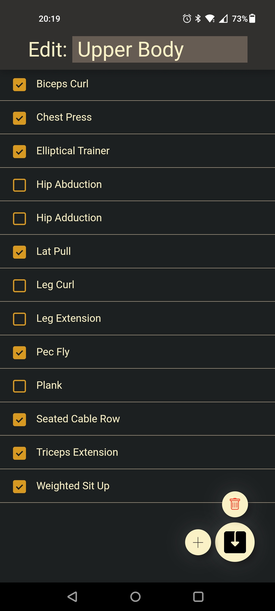
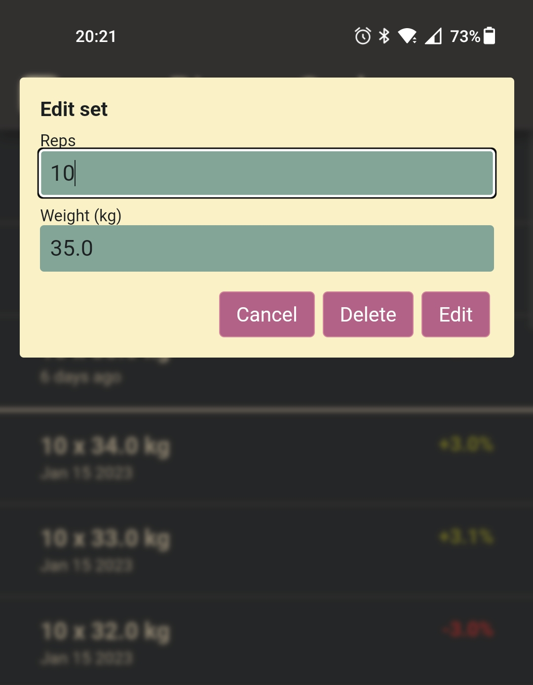

# Gym Log

## Screenshots

| Home                                                         | Workout                                                      | Exercise                                                  |
| ------------------------------------------------------------ | ------------------------------------------------------------ | --------------------------------------------------------- |
|              |       |  |
| Edit workout                                                 | Edit set                                                     |                                                           |
|  |  |                                                           |


## Deployment

1. Initialise the database:

   ```python
   import sqlite3
   
   with open("tools/exercise.sql", "r") as f:
       sql = f.read()
   
   with sqlite3.connect("gym-log.db") as conn:
       c = conn.cursor()
       c.executescrpit(sql)
   conn.close()
   ```

2. Install dependencies

   ```bash
   python3 -m venv venv
   . venv/bin/activate/sh
   python3 -m pip install -r requirements.txt
   python3 -m pip install gunicorn
   ```

3. Test

   ```bash
   gunicorn GymLog:app
   ```

   The ```gymlog.service```  can be used as a template for setting up a systemd service.
