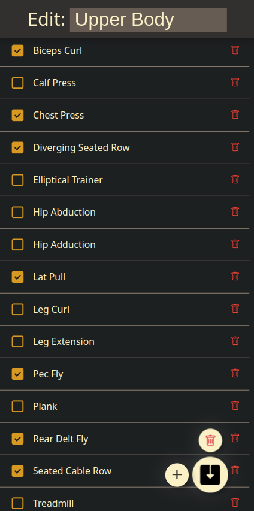

# Gym Log

## Screenshots

| Home                                                         | Workout                                                      | Exercise                                                  |
| ------------------------------------------------------------ | ------------------------------------------------------------ | --------------------------------------------------------- |
|              |       |  |
| Edit workout                                                 | Edit set                                                     |                                                           |
|  |  |                                                           |


## Deployment

Build the docker container

```bash
docker buildx build -t gymlog:latest .
```

Then modify the template docker-compose.yml file to set the correct path for the `data` directory and run with

```bash
docker-compose up -d
```